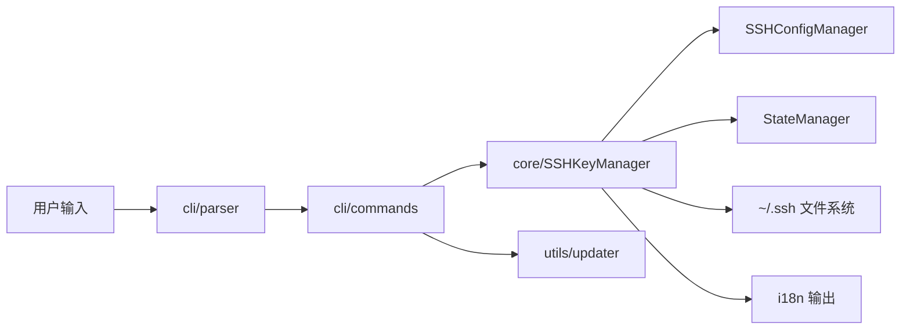

# 👨‍💻 开发者文档

面向开发者的架构说明、开发环境搭建与构建指南。

---

## 📋 目录

- [项目结构](#-项目结构)
- [架构设计](#-架构设计)
- [开发环境搭建](#-开发环境搭建)
- [测试](#-测试)
- [构建可执行文件](#-构建可执行文件)
- [CI/CD](#-cicd)
- [构建注意事项](#-构建注意事项)

---

## 📁 项目结构

```text
SSHManager/
├── src/
│   ├── run_sshm.py              # PyInstaller 入口点（绝对导入）
│   └── sshm/
│       ├── __init__.py          # 包入口（自动初始化 Windows 控制台）
│       ├── __main__.py          # python -m sshm 入口
│       ├── constants.py         # 版本号、密钥类型等常量
│       ├── i18n.py              # 国际化（en/zh 双语输出）
│       ├── cli/
│       │   ├── parser.py        # argparse 命令行参数解析
│       │   ├── commands.py      # 命令路由到核心业务
│       │   └── interactive.py   # 交互式 TUI 菜单
│       ├── core/
│       │   ├── manager.py       # SSHKeyManager 核心业务
│       │   ├── config.py        # SSHConfigManager Config 管理
│       │   └── state.py         # StateManager 状态持久化
│       └── utils/
│           ├── console.py       # 输出格式化、Windows 编码修复
│           ├── system.py        # PATH 配置等系统操作
│           └── updater.py       # 自动更新
├── scripts/
│   ├── build_local.py           # 本地构建脚本
│   ├── install.ps1              # Windows 一键安装
│   ├── install.sh               # Linux/macOS 一键安装
│   ├── cli_test.py              # CLI 冒烟测试
│   └── sandbox_test.py          # 沙箱测试
├── .github/workflows/
│   └── build-release.yml        # 三平台打包发布
└── docs/                        # 项目文档
```

---

## 🏗️ 架构设计

### 分层结构

- **core 层**：纯业务逻辑，不依赖 CLI
  - `SSHKeyManager`：核心业务（创建、切换、配置、测试）
  - `SSHConfigManager`：`~/.ssh/config` 读写
  - `StateManager`：状态文件（`.sshm_state`）持久化
- **cli 层**：命令行交互
  - `parser`：argparse 定义全部子命令
  - `commands`：将参数路由到 core 层
  - `interactive`：交互式 TUI 菜单
- **utils 层**：通用工具（控制台、系统、更新）

> 核心采用**组合模式**：`SSHKeyManager` 内部组合 `SSHConfigManager` 与 `StateManager`，而非继承，降低耦合、便于测试。

### 国际化 (i18n)

- 源字符串使用英文作为 key（同时作为 `en` 显示文本）
- 中文通过翻译表（`ZH` 字典）映射
- 语言优先级：`SSHM_LANG` 环境变量 > 状态文件 `lang` 字段 > 默认 `en`
- 翻译函数 `_(text, **kwargs)`：翻译后支持 `{placeholder}` 格式化

### 数据流



---

## 💻 开发环境搭建

### 前置要求

- **Python 3.14+**（同时兼容 3.11+）
- Git

### 步骤

```bash
git clone https://github.com/365tools/sshm.git
cd SSHManager
pip install pyinstaller   # 构建可执行文件时
```

### 本地运行

```bash
# 命令行方式
PYTHONPATH=src python -m sshm list

# 交互模式
python src/run_sshm.py
```

---

## 🧪 测试

```bash
# CLI 冒烟测试（覆盖全部命令）
python scripts/cli_test.py

# 沙箱测试（隔离环境）
python scripts/sandbox_test.py
```

---

## 🔨 构建可执行文件

### 本地构建

```bash
python scripts/build_local.py
```

等价命令：

```bash
pyinstaller --onefile --name sshm --console --paths src src/run_sshm.py
```

构建产物：`dist/sshm.exe`（Windows）或 `dist/sshm`（Linux/macOS）

### 验证

```bash
./dist/sshm --help
./dist/sshm list
```

---

## 🤖 CI/CD

`.github/workflows/build-release.yml` 会在推送 `v*` 标签时触发：

1. 在 Windows / Linux / macOS 三平台分别构建单文件可执行文件
2. 运行 `--help` 冒烟测试
3. 上传构建产物
4. 自动创建 GitHub Release 并附带三平台安装包

触发方式：

```bash
git tag v0.0.1
git push origin v0.0.1
```

---

## ⚠️ 构建注意事项

1. **入口文件使用绝对导入**：`run_sshm.py` 必须用 `from sshm.xxx import ...` 形式，确保 PyInstaller 静态分析正确。
2. **避免 f-string 跨行/表达式内反斜杠**：此类写法仅 Python 3.12+（PEP 701）支持。项目以 Python 3.14 构建，但为兼容性，建议将复杂表达式先算到变量再放入 f-string。
3. **模块未被打包时的现象**：若 PyInstaller 因模块导入失败将其标记为 `invalid`，运行时会出现 `ModuleNotFoundError`。可检查 `build/sshm/warn-sshm.txt` 中的 `invalid module named ...`。
4. **清理缓存**：修改源码后务必删除 `build/` 目录再重建，否则 PyInstaller 可能复用旧分析结果：
   ```bash
   rm -rf build dist
   pyinstaller --onefile --name sshm --paths src src/run_sshm.py
   ```
